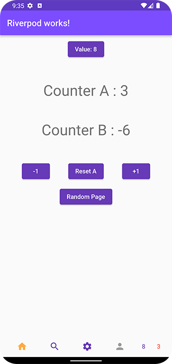
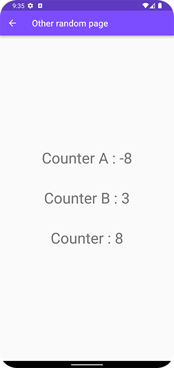
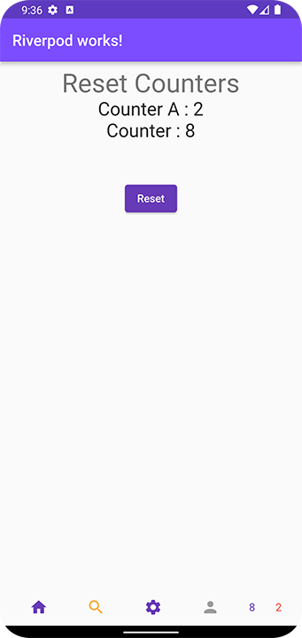

# Readme pour l'Application Flutter avec Riverpod

## Screenshots





## Introduction

Ce Readme vous guide à travers l'installation, la compilation et l'exécution d'une application Flutter de démonstration basée sur le package Riverpod. L'application de démonstration présente des compteurs interactifs et automatiques disponibles sur chaque page, offrant un exemple simple de gestion d'état avec Riverpod.

## Prérequis

Avant de commencer, assurez-vous d'avoir installé Flutter et Dart sur votre système. Si ce n'est pas le cas, suivez les instructions sur le [site officiel de Flutter](https://flutter.dev/docs/get-started/install) pour l'installation.

## Installation

Après avoir cloné ce référentiel sur votre ordinateur, exécutez la commande suivante pour récupérer les dépendances nécessaires à l'aide de `pub get` :

```bash
flutter pub get
```

## Compilation et Exécution

Pour exécuter l'application, utilisez la commande suivante :

```bash
flutter run -d [dispositif]
```

Remplacez `[dispositif]` par le nom ou l'ID du dispositif cible, par exemple, `flutter run -d emulator-1` pour exécuter sur un émulateur Android. Si vous ne spécifiez pas de dispositif, Flutter utilisera le premier dispositif disponible.

## Contributeurs

Si vous souhaitez contribuer à ce projet, n'hésitez pas à créer des issues ou à soumettre des pull requests sur le référentiel GitHub.

Amusez-vous à explorer et à personnaliser cette application !


# Readme for Flutter Application with Riverpod

## Introduction

This Readme guides you through the installation, compilation, and execution of a Flutter application based on the Riverpod package. The demonstration application showcases interactive and automatic counters on each page, providing a simple example of state management with Riverpod.

## Prerequisites

Before getting started, make sure you have Flutter and Dart installed on your system. If not, follow the instructions on the [official Flutter website](https://flutter.dev/docs/get-started/install) for installation.

## Installation

After cloning this repository to your computer, execute the following command to fetch the necessary dependencies using `pub get`:

```bash
flutter pub get
```

## Compilation and Execution

To run the application, use the following command:

```bash
flutter run -d [device]
```

Replace [device] with the name or ID of the target device, for example, flutter run -d emulator-1 to run on an Android emulator. If you don't specify a device, Flutter will use the first available device.

## Contributors

If you'd like to contribute to this project, feel free to create issues or submit pull requests on the GitHub repository.

Enjoy exploring and customizing this application!
